Overdiagnosis
================
Oscar J Ponce & Eddy Lincango
5/18/2020

## R Packages

`metafor`:[package](http://www.metafor-project.org/doku.php) used to
perform the analysis

`forestplot`:[package](https://cran.r-project.org/web/packages/forestplot/forestplot.pdf)
used to create forest plots

## Analysis codes

> \[Click here to view our full script available as `R Markdown` file\]

## Raw data

> \[Click here to view our raw data available as `.CSV` file\]

## Supplementary Figures

**These graphs were used to generate the summary of forest plots
presented in the published article <link>**

 Suppl. Figure 1: (Freeman-Tukey) Frequency of Incidental
diagnosis in patients with TC 

    ## New names:
    ## * `` -> ...1
    ## * `` -> ...2
    ## * `` -> ...3

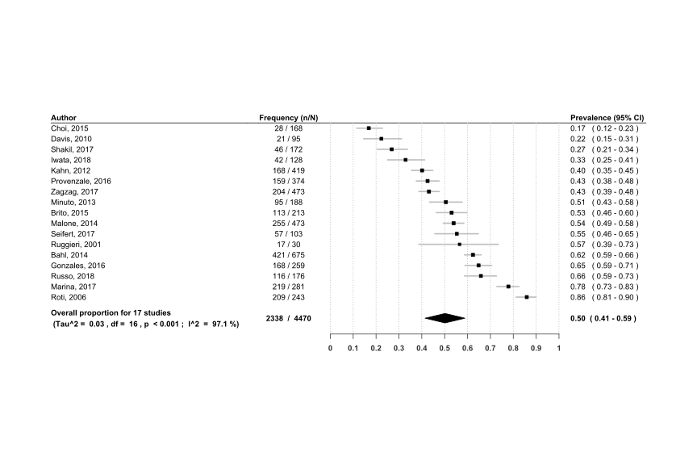<!-- -->

 Suppl. Figure 2: (GLMM) Frequency of Incidental diagnosis in
patients with TC 

    ## New names:
    ## * `` -> ...1
    ## * `` -> ...2
    ## * `` -> ...3

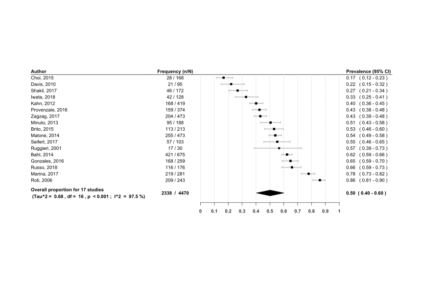<!-- -->

 Suppl. Figure 3: (Freeman-Tukey) Frequency of Incidental
diagnosis in Male patients with TC 

    ## New names:
    ## * `` -> ...1
    ## * `` -> ...2
    ## * `` -> ...3

<!-- -->

 Suppl. Figure 4: (Freeman-Tukey) Frequency of Incidental
diagnosis in Female patients with TC 

<!-- -->

 Suppl. Figure 5: (GLMM) Frequency of Incidental diagnosis in
Male patients 

    ## New names:
    ## * `` -> ...1
    ## * `` -> ...2
    ## * `` -> ...3

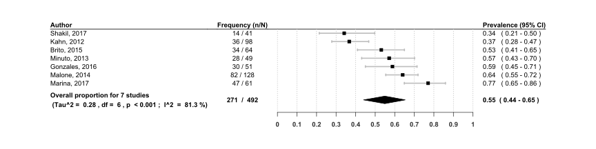<!-- -->

 Suppl. Figure 6: (GLMM) Frequency of Incidental diagnosis in
Female patients 

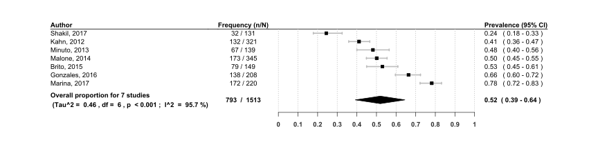<!-- -->

 Suppl. Figure 7: (Freeman-Tukey) Frequency of Incidental
diagnosis in patients with TC and tumor size \>10mm 

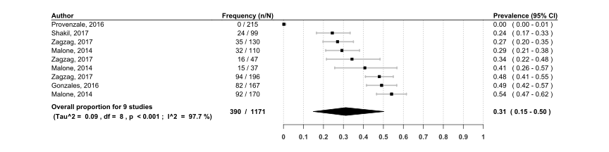<!-- -->

 Suppl. Figure 8: (Freeman-Tukey) Frequency of Incidental
diagnosis in patients with TC and tumor size \<10mm 

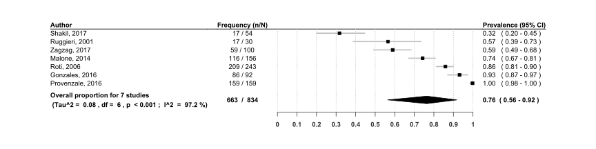<!-- -->

 Suppl. Figure 9: (GLMM) Frequency of Incidental diagnosis in
patients with TC and tumor size \>10mm 

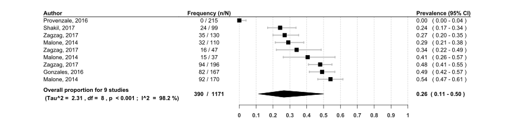<!-- -->

 Suppl. Figure 10: (GLMM) Frequency of Incidental diagnosis in
patients with TC and tumor size \<10mm

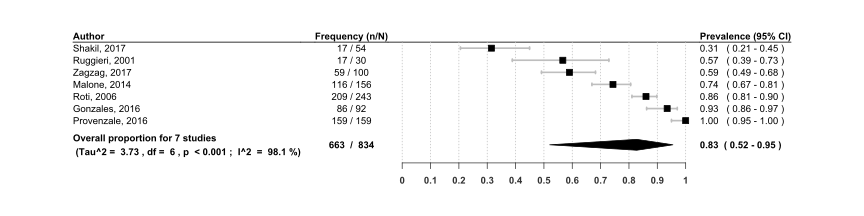<!-- -->

 Suppl. Figure 11: (Freeman-Tukey) Frequency of Incidental
diagnosis in patients with TC from the USA 

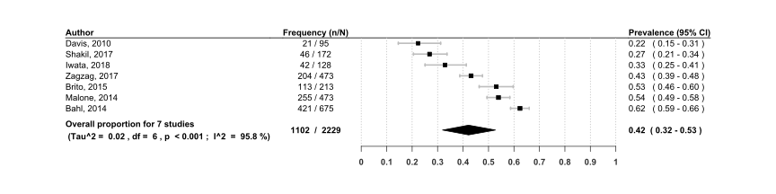<!-- -->

 Suppl. Figure 12: (Freeman-Tukey) Frequency of Incidental
diagnosis in patients with TC from a non-USA country 

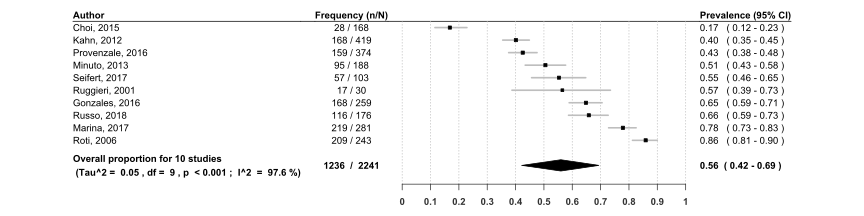<!-- -->

 Suppl. Figure 13: (GLMM) Frequency of Incidental diagnosis in
patients with TC from the USA 

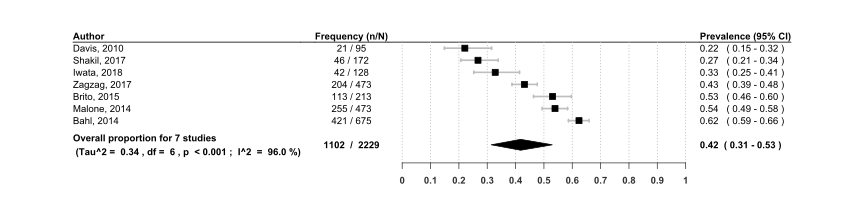<!-- -->

 Suppl. Figure 14: (GLMM) Frequency of Incidental diagnosis in
patients with TC from a non-USA country 

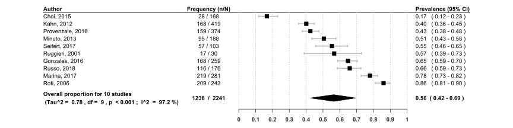<!-- -->

 Suppl. Figure 15: (Freeman-Tukey) Frequency of Incidental
diagnosis in patients with TC from population based studies 

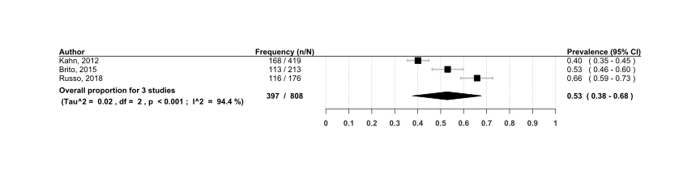<!-- -->

 Suppl. Figure 16: (Freeman-Tukey) Frequency of Incidental
diagnosis in patients with TC from non-population-based studies

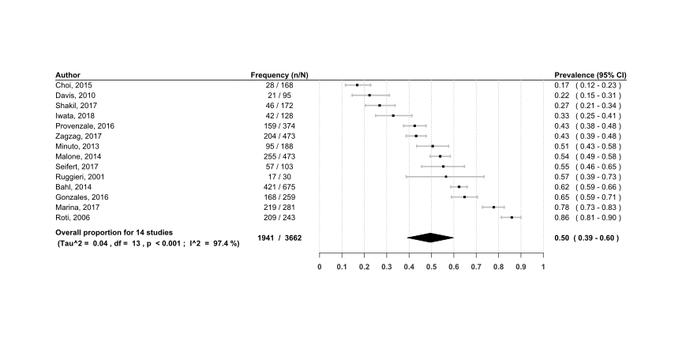<!-- -->

 Suppl. Figure 17: (GLMM) Frequency of Incidental diagnosis in
patients with TC from population-based studies 

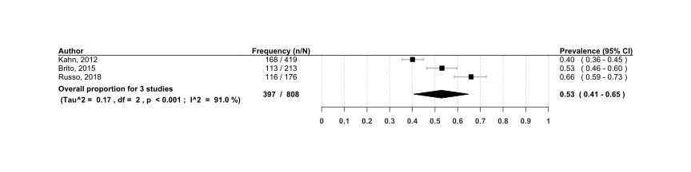<!-- -->

 Suppl. Figure 14: (GLMM) Frequency of Incidental diagnosis in
patients with TC from non-population-based studies 

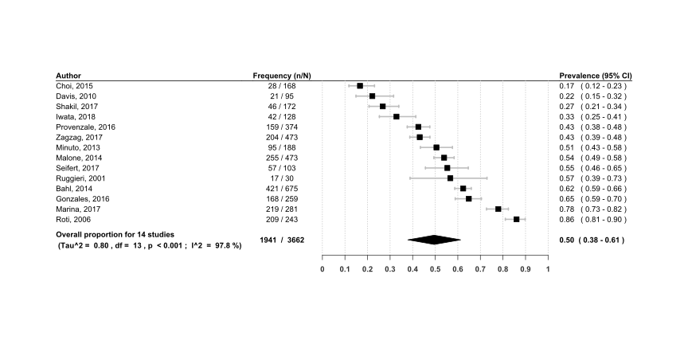<!-- -->

